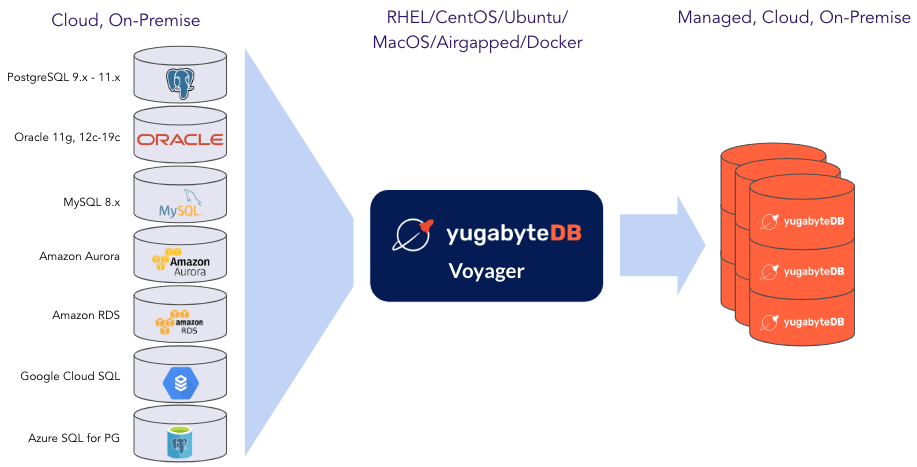
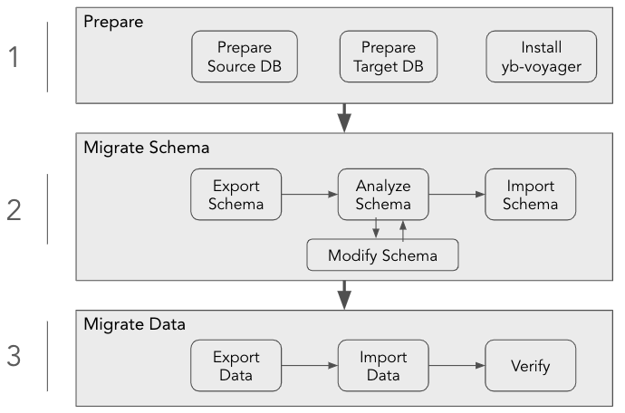
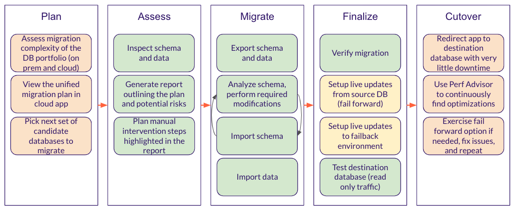

# YugabyteDB Voyager

YugabyteDB Voyager is a powerful open-source data migration engine that accelerates cloud native adoption by removing barriers to moving applications to the public or private cloud. It helps you migrate databases to YugabyteDB quickly and securely.

YugabyteDB Voyager manages the entire lifecycle of a database migration, including cluster preparation for data import, schema-migration, and data-migration, using the yb-voyager command line utility.

You can migrate data to any one of the three YugabyteDB products (Stable versions 2.14.5.0 and later, and preview versions 2.17.0.0 and later). The following cluster types are supported: [Local YugabyteDB clusters](https://docs.yugabyte.com/preview/quick-start/), [YugabyteDB Anywhere](https://docs.yugabyte.com/preview/yugabyte-platform/create-deployments/), [YugabyteDB Managed](https://docs.yugabyte.com/preview/yugabyte-cloud/cloud-basics/)

* [Highlights](#highlights)
* [Prerequisites and Install](#prerequisites-and-install)
* [Migration Steps](#migration-steps)
* [Current Product State and Roadmap](#current-product-state-and-roadmap)
* [Need Help?](#need-help)
* [Contribute](#contribute)
* [License](#license)

# Highlights
- Free and completely open source
- Identical steps and unfied experience for all sources and destinations
- Optimized for distributed databases 
  - Chunks the source files
  - Scales and auto tunes based on cluster size
  - Number of connections based on target configuration
  - Parallelism across tables and within tables
- Idempotent
- Data import is resumable in case of disruption
- Visual progress for data export and import
- Scales with nodes and cpu
- Packaged for easy installation, one-click installer
- Safe defaults
- Direct data import from CSV and text files

# Prerequisites and Install
For prerequisits like supported operating system, machine requirements,  please refer to the [Prerequisites section](https://docs.yugabyte.com/preview/migrate/install-yb-voyager/#prerequisites)

Once the prerequisites are satisifed, you can install yb-voyager on a machine with operating systems like RHEL, Ubuntu, macOS, or even in Airgapped, or Docker enviornment or build using source. For detailed instructions, refer [Install section](https://docs.yugabyte.com/preview/migrate/install-yb-voyager/#install-yb-voyager)

# Migration Steps

The workflow to carry out a migration using *yb-voyager* is as follows:

More details regarding the entire migration workflow, starting from setting up your source and target databases, up until verifying the migration can be found in the [Migration Steps](https://docs.yugabyte.com/preview/migrate/migrate-steps/) on the YugabyteDB Voyager Docs.

# Current Product State and Roadmap

# Need Help?

* You can ask questions, find answers, and help others on our Community [Slack](https://communityinviter.com/apps/yugabyte-db/register), [Forum](https://forum.yugabyte.com), [Stack Overflow](https://stackoverflow.com/questions/tagged/yugabyte-db), as well as Twitter [@Yugabyte](https://twitter.com/yugabyte)

* Please use [GitHub issues](https://github.com/yugabyte/yb-voyager/issues) to report issues or request new features.

# Contribute

As an an open-source project with a strong focus on the user community, we welcome contributions as GitHub pull requests. See our [Contributor Guides](https://docs.yugabyte.com/preview/contribute/) to get going. Discussions and RFCs for features happen on the design discussions section of our [Forum](https://forum.yugabyte.com).
# License

Source code in this repository is variously licensed under the Apache License 2.0 and the Polyform Free Trial License 1.0.0. A copy of each license can be found in the [licenses](licenses) directory.

The build produces two sets of binaries:

* The entire database with all its features (including the enterprise ones) are licensed under the Apache License 2.0
* The  binaries that contain `-managed` in the artifact and help run a managed service are licensed under the Polyform Free Trial License 1.0.0.

> By default, the build options generate only the Apache License 2.0 binaries.

